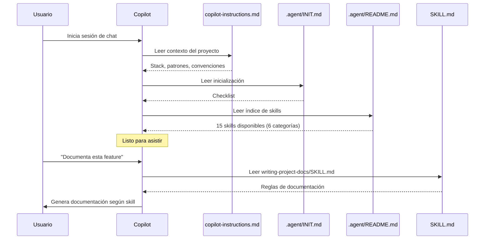

# Inicialización de GitHub Copilot

Este archivo define el proceso de inicialización para cada sesión de asistencia.

## 📋 Checklist de Inicialización

Al inicio de cada sesión, GitHub Copilot DEBE:

### 1️⃣ Leer Contexto Global
- ✅ `.github/copilot-instructions.md` - Contexto completo del proyecto
- Stack, framework y base de datos del proyecto
- Patrones: Nomenclatura, manejo de errores, logging, sesión
- Convenciones: repositorio, branches, work items

### 2️⃣ Leer Configuración de Agent
- ✅ `.agent/AGENTS.md` - Perfil Superpowers
  - Reglas de ejecución
  - Política de artefactos
  - Restricciones de Git

### 3️⃣ Cargar Índice de Skills
- ✅ `.agent/README.md` - Skills disponibles (15 skills en 6 categorías)
  - **Planificación:** `brainstorming`, `writing-plans`, `executing-plans`, `single-flow-task-execution`
  - **Documentación:** `writing-project-docs`, `writing-skills`, `generate-copilot-instructions`
  - **Testing/Debugging:** `systematic-debugging`, `test-driven-development`
  - **Validación:** `verification-before-completion`, `requesting-code-review`, `receiving-code-review`
  - **Git:** `using-git-worktrees`, `finishing-a-development-branch`
  - **Meta:** `using-superpowers`

### 4️⃣ Cargar Skills Bajo Demanda
**NO** leer todos los `SKILL.md` al inicio. Cargar solo cuando el contexto lo requiera:

| Contexto del Usuario | Skill a Cargar | Categoría |
|---------------------|----------------|-----------|
| Crear feature/componente/funcionalidad | `brainstorming` | Planificación |
| Necesita plan de implementación | `writing-plans` | Planificación |
| Tiene plan y debe ejecutarlo | `executing-plans` | Planificación |
| Documenta feature/PR | `writing-project-docs` | Documentación |
| Crear skill personalizado | `writing-skills` | Documentación |
| Generar o replicar `copilot-instructions.md` | `generate-copilot-instructions` | Documentación |
| Analiza error/bug | `systematic-debugging` | Testing/Debugging |
| Escribe tests | `test-driven-development` | Testing/Debugging |
| Listo para commit/merge | `verification-before-completion` | Validación |
| Va a solicitar code review | `requesting-code-review` | Validación |
| Recibió feedback de review | `receiving-code-review` | Validación |
| Trabajo con múltiples branches | `using-git-worktrees` | Git |
| Cerrar/finalizar branch | `finishing-a-development-branch` | Git |
| Al inicio de cualquier sesión | `using-superpowers` | Meta |

---

## 🎯 Reglas de Aplicación de Skills

### ✅ HACER
- Aplicar skill automáticamente cuando el contexto coincide
- Seguir las reglas del skill sin pedir confirmación
- Mantener formato y estándares definidos en el skill
- Combinar skill con contexto de `copilot-instructions.md`

### ❌ NO HACER
- NO pedir permiso para aplicar un skill
- NO mezclar reglas de múltiples skills simultáneamente
- NO ignorar las restricciones del skill
- NO crear artefactos no solicitados (ver AGENTS.md)

---

## 🔄 Workflow por Tipo de Solicitud

### Planificación y Diseño

#### Brainstorming / Diseño
```
1. Detectar: Usuario quiere crear feature/componente
2. Cargar: .agent/skills/brainstorming/SKILL.md
3. Aplicar: Exploración → Preguntas → Propuestas → Diseño
4. Validar: ¿Usuario aprobó diseño? (HARD-GATE)
```

#### Plan de Implementación
```
1. Detectar: Usuario solicita plan escrito
2. Cargar: .agent/skills/writing-plans/SKILL.md
3. Aplicar: Tareas granulares (2-5 min cada una)
4. Validar: ¿Plan claro y completo?
```

#### Ejecutar Plan
```
1. Detectar: Usuario tiene plan y debe ejecutarlo
2. Cargar: .agent/skills/executing-plans/SKILL.md
3. Aplicar: Batches de 3 tasks + checkpoints
4. Validar: ¿Batch completado correctamente?
```

---

### Documentación

#### Documentación de Feature
```
1. Detectar: Usuario pide documentar/crear guía
2. Cargar: .agent/skills/writing-project-docs/SKILL.md
3. Aplicar: Formato de ~150-200 líneas, tablas, 7 escenarios
4. Validar: ¿Cumple con estándares del proyecto?
```

#### Crear Skill Personalizado
```
1. Detectar: Usuario quiere crear un skill
2. Cargar: .agent/skills/writing-skills/SKILL.md
3. Aplicar: YAML frontmatter + estructura estándar
4. Validar: ¿Skill bien formateado?
```

#### Generar Copilot Instructions
```
1. Detectar: Usuario quiere crear o replicar `.github/copilot-instructions.md`
2. Cargar: .agent/skills/generate-copilot-instructions/SKILL.md
3. Aplicar: Inventario de proyectos → path relativo a `.agent` → preguntas faltantes → generación por carpeta
4. Validar: ¿Cada archivo apunta a la `.agent` correcta y quedó sin placeholders?
```

---

### Testing y Debugging

#### Debugging / Análisis de Error
```
1. Detectar: Usuario reporta error o pide analizar
2. Cargar: .agent/skills/systematic-debugging/SKILL.md
3. Aplicar: Análisis sistemático + trazabilidad
4. Validar: ¿Hipótesis verificables?
```

#### Testing
```
1. Detectar: Usuario pide crear/modificar tests
2. Cargar: .agent/skills/test-driven-development/SKILL.md
3. Aplicar: Patrones TDD adaptados al stack del proyecto
4. Validar: ¿Cobertura de edge cases?
```

---

### Validación y Code Review

#### Pre-Commit / Pre-Merge
```
1. Detectar: Usuario listo para commit/PR
2. Cargar: .agent/skills/verification-before-completion/SKILL.md
3. Aplicar: Checklist completo
4. Validar: ¿Todos los criterios cumplidos?
```

#### Solicitar Code Review
```
1. Detectar: Usuario va a pedir code review
2. Cargar: .agent/skills/requesting-code-review/SKILL.md
3. Aplicar: Pre-review checklist + descripción PR
4. Validar: ¿PR listo para reviewers?
```

#### Recibir Code Review
```
1. Detectar: Usuario recibió feedback de review
2. Cargar: .agent/skills/receiving-code-review/SKILL.md
3. Aplicar: Análisis + priorización + plan de correcciones
4. Validar: ¿Todos los comentarios procesados?
```

---

### Git y Workflow

#### Git Worktrees
```
1. Detectar: Usuario necesita trabajo paralelo
2. Cargar: .agent/skills/using-git-worktrees/SKILL.md
3. Aplicar: Creación de worktree + aislamiento
4. Validar: ¿Worktree funcionando correctamente?
```

#### Finalizar Branch
```
1. Detectar: Branch listo para cerrar
2. Cargar: .agent/skills/finishing-a-development-branch/SKILL.md
3. Aplicar: Checklist de cierre + cleanup
4. Validar: ¿Branch cerrado correctamente?
```

---

### Meta

#### Using Superpowers
```
1. Detectar: Al inicio de sesión
2. Cargar: .agent/skills/using-superpowers/SKILL.md
3. Aplicar: Reglas de detección de skills
4. Validar: ¿Skills aplicándose automáticamente?
```

---

## 🚀 Inicio de Sesión - Secuencia



---

## 📊 Verificación de Inicialización

Después de la inicialización, el agente puede responder:

✅ **"¿Qué skills tienes?"**
→ Debe listar los 15 skills de `.agent/README.md` en 6 categorías

✅ **"¿Qué stack usa este proyecto?"**
→ Debe responder con el stack definido en `.github/copilot-instructions.md`

✅ **"¿Cómo documento una feature?"**
→ Debe aplicar `writing-project-docs` automáticamente

---

## 🔧 Troubleshooting

### Problema: Skills no se aplican automáticamente
**Solución:** Verificar que `.agent/README.md` existe y está indexado

### Problema: Copilot no encuentra skills
**Solución:** Mencionar explícitamente "aplica skill {nombre}"

### Problema: Skills se contradicen con copilot-instructions
**Solución:** `copilot-instructions.md` tiene prioridad. El skill complementa, no reemplaza.

---

**Propósito:** Garantizar inicialización consistente de GitHub Copilot  
**Mantener sincronizado con:** `.agent/README.md` (15 skills), `.agent/AGENTS.md`
